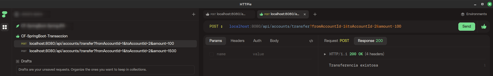
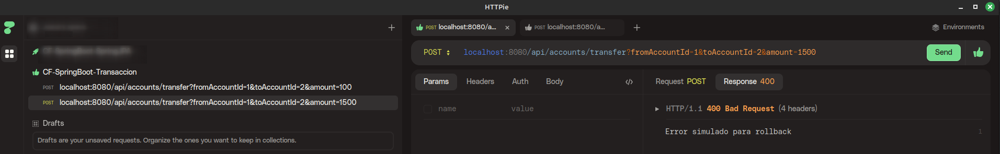
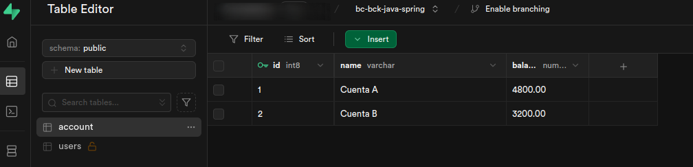

# CRUD en H2 con SpringBoot y Spring Data JPA + Transaccionalidad

Dinámica de código facilito, donde se hace un ejemplo de CRUD sobre una base de datos, en este caso H2 en memoria, y con SpringBoot y Spring Data JPA, y transacciones
Simulamos una transacción económica entre dos cuentas bancarias.

- Tiene la estructura
    - `model`: La capa de modelo se encarga de representar los datos del proyecto.
    - `repository`: La capa de repositorio se encarga de interactuar con la base de datos.
    - `service`: La capa de servicio se encarga de la lógica de negocio del proyecto.
    - `controller`: La capa donde están los endpoint del Servicio REST


- Solo tiene como modelo una tabla
    - `account`: contiene 3 campos: name, balance y un id (secuencia)

- [Guía para el Desarrollo de un CRUD con Spring Data JPA.pdf](https://drive.google.com/file/d/1V0ucVOMmcuEM82FyZZKVB7OfcQpBSfNv/view?usp=drive_link)
- Si se quiere hacer con MySql aquí estaría una guía para bajárselo, solo es necesario cambiar el script para crear la tabla y el url para el driver de mysql
- [Guia para instalar MySQL.pdf](https://drive.google.com/file/d/1VRtcoVcQTyesOLvaoDpCN1g8FZkjn4ci/view)

## Imágenes de las llamadas Rest

- Una transación realizada correctamente

```sh
curl --location --request POST
'http://localhost:8080/api/accounts/transfer?fromAccountId=
1&toAccountId=2&amount=100'
```


- Una transacción con error

```shell
curl --location --request POST
'http://localhost:8080/api/accounts/transfer?fromAccountId=
1&toAccountId=2&amount=1500'
```



- Situación de base de datos, dos cuentas



```sql 
-- Crea la tabla
CREATE TABLE account (
id SERIAL PRIMARY KEY,
name VARCHAR(255) NOT NULL,
balance DECIMAL(10,2) NOT NULL DEFAULT 0.00
);

-- inserta 2 registros
INSERT INTO account (name, balance) VALUES
('Cuenta A', 5000);

INSERT INTO account (name, balance) VALUES
('Cuenta B', 3000);
```